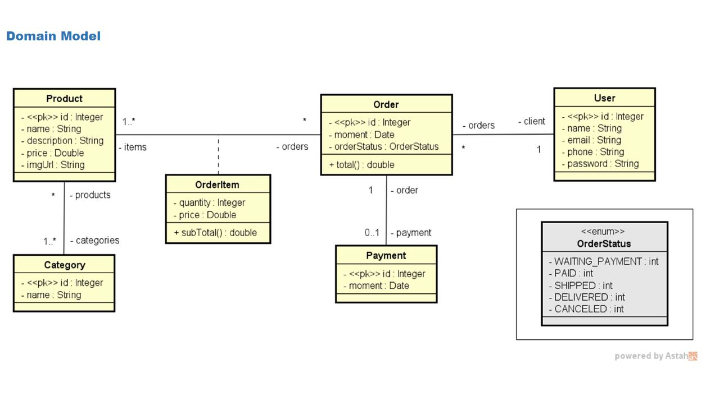
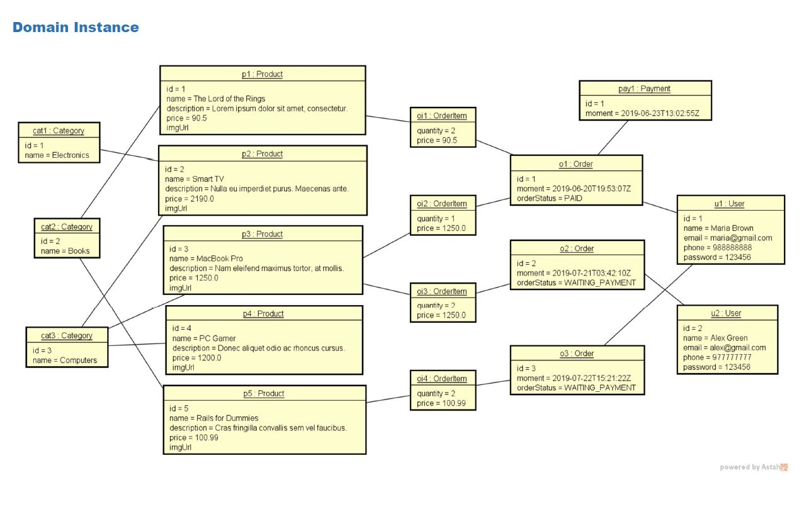
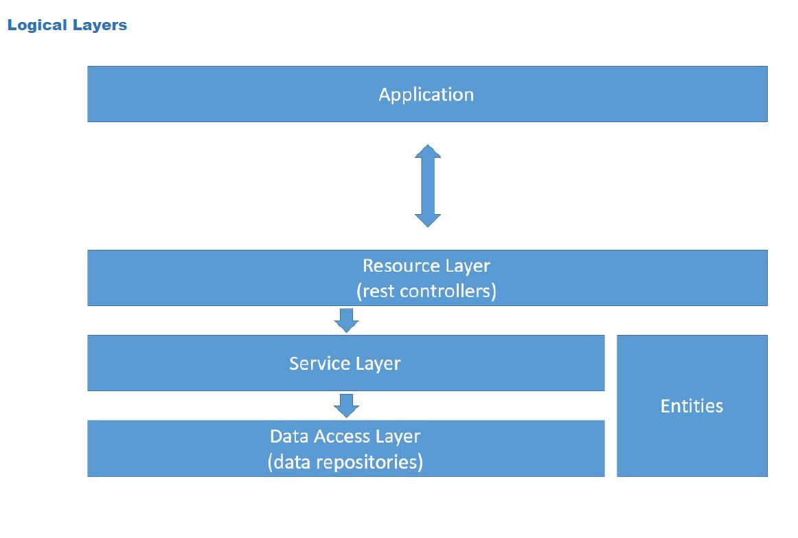

# ecommerceapp

<h3>Aplicativo web de Ecommerce feito com Spring Boot, JPA e Hibernate</h3>
 

<h3>Objetivos:</h3>
 

 Criar projeto Spring Boot Java
 Implementar modelo de domínio
 Estruturar camadas lógicas: resource, service, repository
 Configurar banco de dados de teste (H2)
 Povoar o banco de dados
 CRUD - Create, Retrieve, Update, Delete
 Tratamento de exceções

Será utilizado a seguinte implementação de modelo conceitual para atingirmos o nosso objetivo:

 

 

 

 
<h2 align="center">*** EM CONSTRUÇÃO!!! ***</h2>
 
